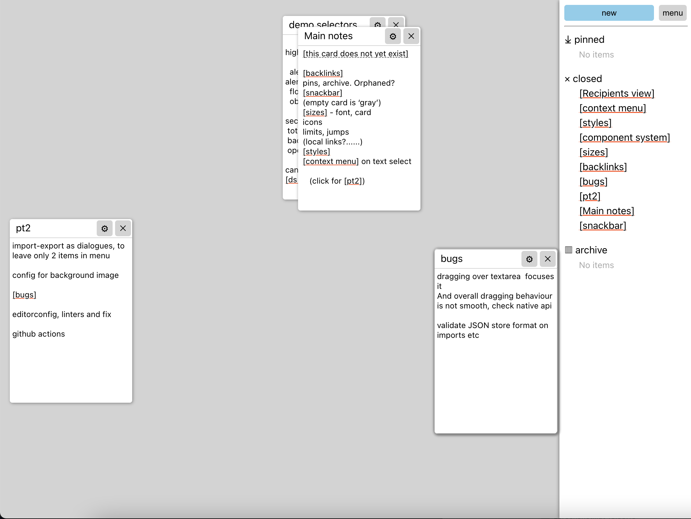

# ZK React

Simple, Zettelkasten-inspired notes app.

Main feature is simple cards linking: just wrap some text in square brackets, and it will create link to a card with such name. Existing cards are underlined in red, new cards are underlined in gray. Ctrl-click (or Ctrl-Enter) on a link to open that card on workplace.

## Screenshot

